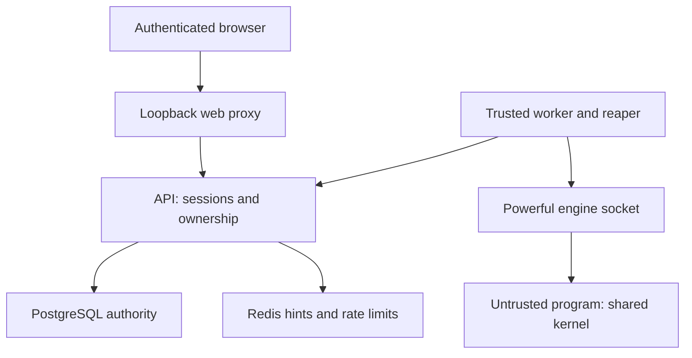

# Security model

## Intended use and trust boundaries

Local CodeGrid is an educational execution lab for a machine you control. Keep the default loopback listeners. It is not approved for anonymous public submissions or valuable shared hosts. Submitted programs are untrusted; the operator, API, workers, reaper, engine, kernel, compiler images, and PostgreSQL are trusted. A user owns only their own jobs, source, events, and results. An administrator can create nodes and read audit records, but the ordinary job endpoints still enforce ownership.

## Threats and implemented controls

| Threat | Controls | Residual risk |
|---|---|---|
| Kernel/container escape | UID 65534, default seccomp enforced by probe, all capabilities dropped, no-new-privileges, read-only root, no host mounts, no network | A kernel or runtime vulnerability can still compromise the host. Containers are not VMs. |
| Engine takeover | Socket mounted only in trusted worker/reaper; never in API, web, or submitted-code containers; node tokens stored hashed by API | The worker/reaper can control the engine. A compromised worker is a host-level event. Rootless Podman reduces host authority but does not protect that user's data. |
| Resource exhaustion | Per sandbox: 1 CPU, 512 MiB including no swap, 128 processes, 128 file descriptors, 32 MiB file-size limit, 64 MiB `/work`, 16 MiB `/tmp`, 16 MiB shared memory; 32 KiB combined raw output per attempt | Compiler images/builds consume host disk. Engine operations and trusted control services need separate headroom. Cgroups do not provide disk I/O isolation or hardware side-channel protection. |
| Infinite or orphan execution | Compiler 12s, program 6s, outer container 20s; worker monotonic phase/90s attempt watchdog, 15s renewable API leases; reaper with persistent ledger tombstones | Suspending the entire VM pauses its processes. Wall-clock jumps and kernel failure are not fully solved by a container timer. The host must remain healthy. |
| Process survives lease expiration | Quarantine and retained database reservation until reaper fences shared ledger, removes containers, and confirms absence; local ledger identity bound to node | Deliberate manual ledger deletion or sharing a token with a different host violates the trusted operator model. Never clear tombstones to force scheduling. |
| Stale/duplicate delivery | Row locks, monotonically increasing attempt generation, owner-scoped request keys, log chunk hashes, repeated report hashes, fenced completion | Execution may happen again after a crash. There is one accepted terminal result, not exactly-once execution. |
| Cross-user data theft | Ownership check before job, cancel, events and WebSocket operations; unknown/foreign jobs return 404; CSRF tokens, SameSite=Strict HttpOnly sessions, Origin checks | A local administrator/host owner can read the database. There is no disk encryption supplied by this project. |
| Password guessing/session theft | BCrypt cost 12; passwords at least 12 characters and at most 72 UTF-8 bytes; 256-bit random sessions, SHA-256 token storage, 8h expiration; Redis token buckets | Local HTTP cookies use Secure=false by default because the app is HTTP on loopback. Remote browser use requires a proper TLS reverse proxy and Secure cookies. |
| XSS/log injection | React text rendering, Markdown HTML disabled, restrictive CSP, bounded messages, no HTML in logs | Do not replace text rendering with unsafe innerHTML or execute source in the browser. |
| Network/data exfiltration | Per submission `--network=none`; source/input through stdin; no secret environment variables, host paths, or engine socket in sandbox | Source and submitted test data remain visible to the trusted operator and database. Test expectations are not sent into the sandbox, but this is not a high-security secret-test judge. |
| Queue/storage exhaustion | Four active jobs/user, 100 users, 10,000 total jobs, bounded source/tests/results/events, rate limits, cache TTLs, capped Redis memory, bounded log queues, audit retention | Storage grows up to configured application caps. Operator backup/retention is required; Redis memory exhaustion fails admission closed. |
| Dependency compromise | Public open-source packages, lockfile, digest-pinned base images, fixed commands/images, no dependency installs at execution time, pinned CI actions | Digest pins are reproducible, not proof of safety. Review and update images/packages regularly; apt packages in image builds are not snapshot-pinned. |

The `/work` tmpfs is deliberately executable for C++ binaries; `/tmp` is not. An executable workspace does not grant host filesystem access. All languages compile/run in the same resource-restricted container for each case. Java needs the chosen memory/process envelope even for small programs.

## Host requirements and handling incidents

Use Linux cgroups v2 and a functioning seccomp profile. Worker startup runs 13 actual checks inside each language image, including swap, memory, CPU, PIDs, mount flags, UID, capabilities, seccomp, and network interfaces. It refuses work when any check fails. Do not use `--privileged`, `seccomp=unconfined`, or disable these probes to make startup succeed.

A suspected sandbox escape means the host is compromised: disconnect it, stop CodeGrid, preserve evidence, rotate generated credentials from a trusted machine, and rebuild the environment. An ordinary lost worker means inspect reaper/API logs and let cleanup complete. Do not edit `attempts.cleaned`, reduce generation, or remove the ledger by hand.

Secrets live in ignored `.env` / `.env.node` files. Backups contain passwords' hashes, source, and session/token hashes; protect them like database contents. Application audit records intentionally omit passwords, session values, node tokens and source. Do not upload `.env`, raw databases, or confidential submissions as CI artifacts.

## Security verification

`ControlPlaneIT` exercises ownership, CSRF, login, concurrency and stale/duplicate authority. `scripts/system_test.py` runs bounded malicious examples to test network, filesystem, processes, memory, output and time. Browser tests check HTML-shaped output remains inert. These suites do not prove absence of kernel escapes. See [verification](docs/verification.md) for the executions actually completed.

Primary references: [Docker resource constraints](https://docs.docker.com/engine/containers/resource_constraints/), [Docker security](https://docs.docker.com/engine/security/), [default seccomp](https://docs.docker.com/engine/security/seccomp/), and [OWASP WebSocket guidance](https://cheatsheetseries.owasp.org/cheatsheets/WebSocket_Security_Cheat_Sheet.html).
