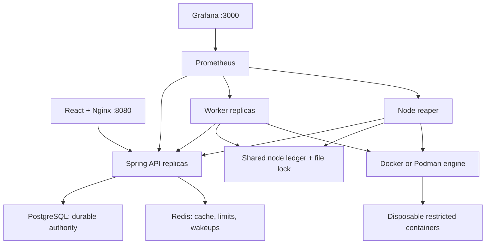
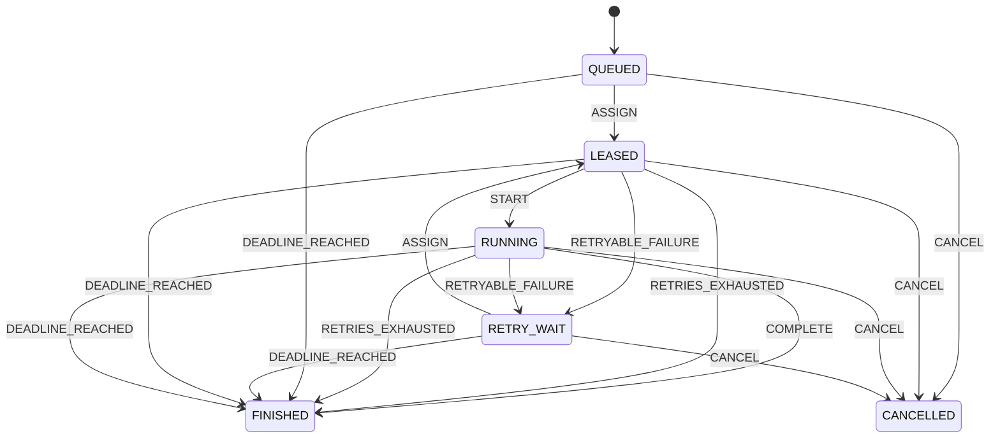
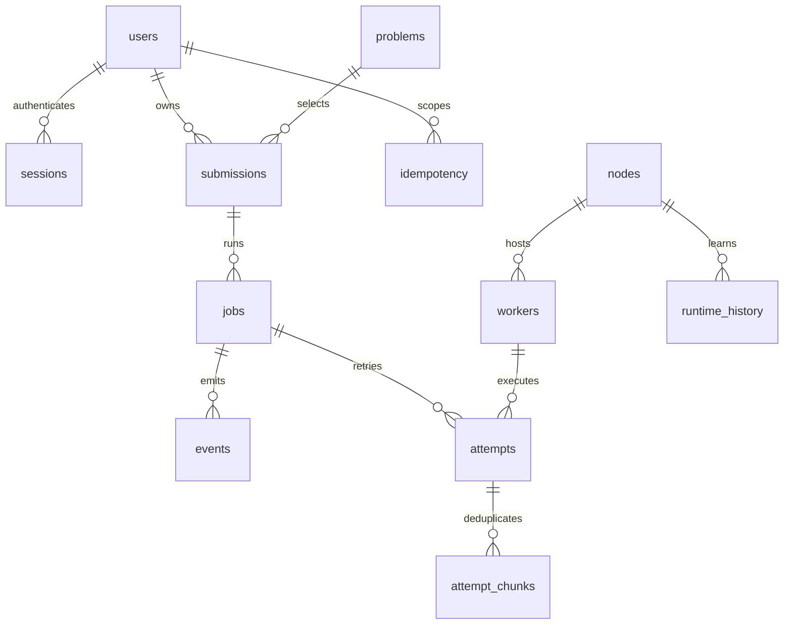

# Architecture and engineering decisions

## Services

Browsers use a same-origin WebSocket for durable job events. No browser, API, database or cache has an engine socket. Workers make authenticated HTTP requests, so another existing local computer can join through an SSH tunnel. Each physical engine uses one node identity and shared local ledger; each process gets a new worker UUID after restart. Same-engine worker replicas share capacity rather than multiplying it.

PostgreSQL owns every state transition and reservation. Redis accelerates notification and immutable source reads, and enforces shared token buckets. Losing a Redis notification cannot lose an assignment: workers also query PostgreSQL through the API. New admission fails closed while rate limits are unavailable; already admitted jobs can finish through PostgreSQL. Losing PostgreSQL removes renewal authority, so execution stops and cleanup runs.

## Job state and verdict

`FINISHED` and `CANCELLED` are terminal. A terminal state cannot transition again. Completion/cancellation races lock the job row; the first committed terminal result wins. A terminal job can still have an uncleared resource reservation until physical cleanup finishes. Lifecycle and resource lifecycle are related but distinct.

Verdicts describe the result: `ACCEPTED`, `WRONG_ANSWER`, `COMPILE_ERROR`, `RUNTIME_ERROR`, `MEMORY_LIMIT`, `TIME_LIMIT`, `OUTPUT_LIMIT`, `INFRA_ERROR`, or `CANCELLED`. An expired overall job deadline is reported as `TIME_LIMIT`. Infrastructure errors can create another generation; user-code errors do not retry. Verify exact transition rules in `JobLifecycle.java`; controllers never invent extra state edges.

## Transaction boundaries and algorithms

1. **Admission:** validate bounded input; lock the submitting user; compare `(owner, Idempotency-Key)` and request hash; enforce active/global caps; insert immutable submission, job, key mapping, and first event in one transaction. A lost HTTP response can be retried safely with the identical key and payload.
2. **Scheduling:** periodically lock ready jobs with `FOR UPDATE SKIP LOCKED`. An advisory lock serializes the small scheduler decision section across API replicas. Eligible workers must be fresh, support the language, have no uncleared attempt, and belong to a healthy node with spare CPU, memory and slots. Lock the chosen node and recheck reservations, then increment generation, create attempt, and write outbox/event atomically.
3. **Score:** expected runtime from node/language EWMA (alpha 0.2), falling back to the language estimate adjusted by configured node speed; multiply by `1 + load / allocatedCPUs`, then add 250ms per occupied slot. Pick lowest score with a stable worker-ID tie break. Oldest jobs are considered first. This is a transparent heuristic, not an optimal scheduler or per-program performance predictor.
4. **Delivery:** publish outbox notifications to a bounded Redis list, then mark published. A crash between those steps duplicates the message. Workers regard the notification as a hint and read their current fenced assignment from the database.
5. **Execution authority:** every start, renewal, log write, and completion checks job generation, worker identity, active state, database lease time and hard deadlines under the job lock. The worker separately holds a shared ledger intent before creating any submitted-code container. Attempts reserve one CPU and 512 MiB each.
6. **Retry:** at most three attempts. Full jitter uniformly chooses a delay between zero and the exponential cap `min(30s, 2s * 2^(attempt-1))`. The next ready time is persisted. Infrastructure failure and lease loss can retry; the job's five-minute deadline remains absolute.
7. **Cleanup:** lease loss quarantines the node and retains capacity. Reaper/worker fences the persistent ledger entry under an OS file lock, removes all containers bearing the attempt labels, verifies absence, releases the local intent, then acknowledges cleanup. A node ID is bound to the ledger UUID to reject accidental registration of a second filesystem as the same host.

The database transaction prevents double reservation by API replicas. The node file lock prevents separate JVMs from starting more sandboxes than the same hardware budget permits. Both are needed because a database lease cannot physically kill a process. Retrying can execute code twice; fencing limits accepted writes to the current attempt. Never call this exactly-once execution.

## Challenge catalog

`problems` stores the statement, difficulty, four language starters, visible examples, and additional tests. `GET /api/problems` projects only the public fields. A challenge submission carries a slug and candidate source; `JobService` resolves the authoritative test set in the admission transaction and ignores tests supplied by the browser. The worker receives every case, while job reads replace the stored set with `public_tests`. Modifying a request in browser developer tools therefore cannot turn a challenge into an easy self-authored assertion.

The cases are hidden from ordinary application users, not cryptographically secret from the owner of an open-source self-hosted installation. A machine administrator can inspect the migration or database. This demonstrates an API trust boundary rather than DRM.

## Schema

The executable schema is applied by Flyway: [V1__core.sql](../backend/api/src/main/resources/db/migration/V1__core.sql) establishes execution state and [V2__challenge_catalog.sql](../backend/api/src/main/resources/db/migration/V2__challenge_catalog.sql) adds the problem catalog. Use new migrations after this release; never modify an applied version.

| Table | Key / important indexes | Purpose |
|---|---|---|
| users | UUID; unique username | BCrypt hash and USER/ADMIN role |
| sessions | SHA-256 token; expiry index | Shared, expiring sessions and CSRF token |
| problems | slug | Public statement/starters and server-controlled test definitions |
| submissions | UUID; owner FK; partial problem/time index | Immutable language/source/tests/mode and optional challenge |
| jobs | UUID; `(owner_id, created_at DESC)`; partial ready-job index | Current state, generation, deadline and event cursor |
| idempotency | `(owner_id, key)` | Request hash to original job mapping |
| nodes | node ID; bound ledger UUID | Engine budget, token hash, heartbeat and quarantine |
| workers | UUID; `(node_id, heartbeat)` | Process identity and immutable image IDs |
| attempts | `(job_id, generation)`; partial expiry/reservation indexes | Lease, hard deadline, result/hash, cleanup state |
| attempt_chunks | `(job_id, generation, sequence)` | Payload hashes for duplicate log delivery |
| events | `(job_id, seq)` | Durable ordered log/status replay |
| outbox | identity ID; partial unpublished index | Commit-safe assignment notifications |
| runtime_history | `(node_id, language)` | Sample count and EWMA duration |
| audit_log | identity ID; recent-time index | Authentication, ownership and operator actions |

Job state/terminal timestamp/verdict consistency, source byte limits, generation range, and resource budgets have database constraints. Application transactions enforce cross-row rules. PostgreSQL application credentials cannot create roles/databases or act as superuser. The separate database administrator credential is used by bootstrap/backup tools only.

## Deliberate scope and tradeoffs

- Single PostgreSQL instance and Redis instance: scalable APIs/workers, not a highly available database cluster. Scheduling decisions are serialized for understandable safety; this is a throughput ceiling to measure before redesigning.
- Same source is recompiled for every case and repetition. This costs time but keeps containers disposable and avoids shared artifact trust/caching complexity. Benchmark results are explicitly cold end-to-end measurements.
- CPU is a bandwidth limit and memory is a hard cgroup limit. Timing varies with host contention; reservations account only for CodeGrid's configured sandbox budget, not every application on the host.
- Logs are durably stored before being streamed. This costs database I/O but makes refresh/reconnect reliable. Backpressure is bounded; if output cannot be recorded safely the attempt fails rather than consuming unbounded memory.
- Global/user history caps keep a student deployment bounded. There is no automatic source/history eviction; the operator controls backups and resets. Sessions, published outbox entries, and old audit entries are pruned.
- No external AI explanation service, Kubernetes, Terraform, billing, dependency downloads, arbitrary compiler flags, interactive stdin, file uploads, or secret test judging. Compiler messages and the local lessons work without an API key.
