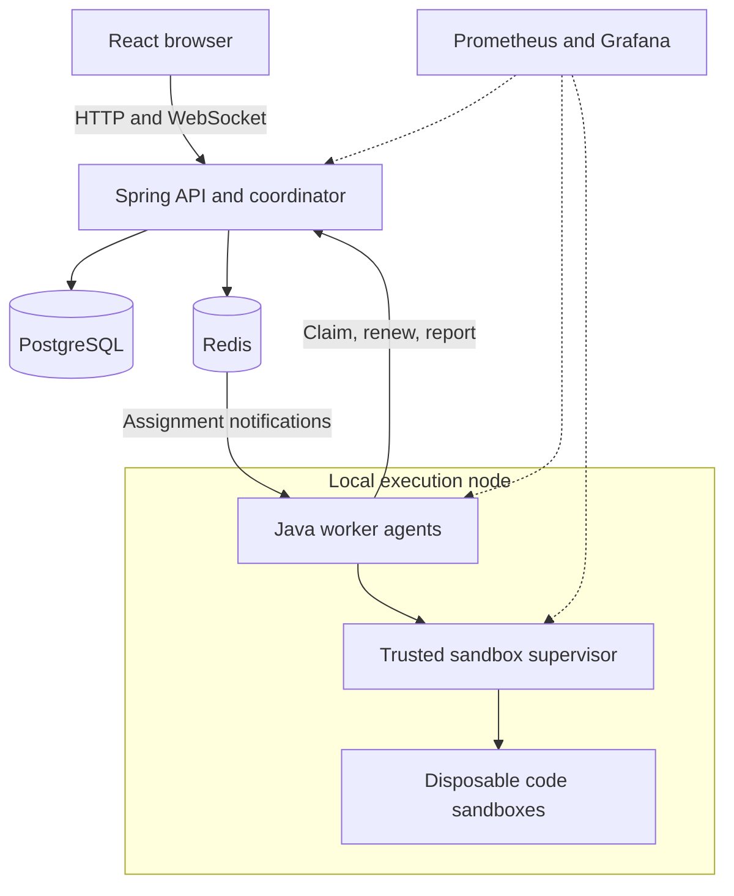
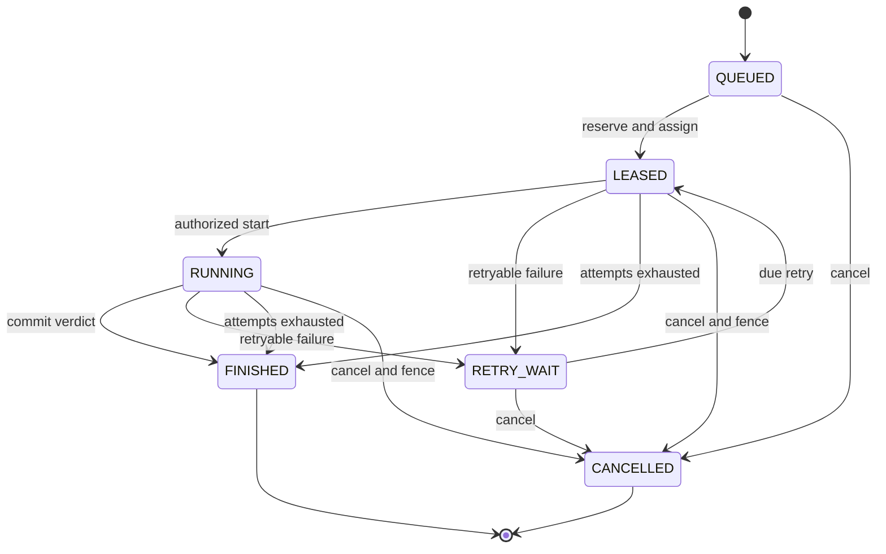

> Historical planning document. The completed local implementation differs in several deliberate ways; use [architecture.md](architecture.md), [openapi.yaml](openapi.yaml), and [verification.md](verification.md) for current behavior and evidence.

# Local CodeGrid — project blueprint and mentoring plan

Design date: September 8, 2026. This document supersedes the earlier cloud-oriented scope. It describes a proposed system; the application, commands and performance results have not been implemented or measured yet.

Build a small local system with strong, explainable guarantees: authenticated users submit code, a scheduler assigns bounded execution to workers, failures trigger safe recovery, and the UI shows what happened. The project requires no paid API, subscription, cloud runtime, purchased hardware or proprietary runtime dependency. GitHub Actions is the optional hosted CI service explicitly allowed in the brief; every check must also be runnable locally.

Assume roughly 12–18 focused hours per week for ten weeks, with security and correctness gates controlling progress. The initial reference machine is an existing computer with four logical CPUs and 8 GiB RAM; this is a planning target to validate, not a request to buy hardware. Start with one execution slot and adapt to measured capacity. Linux with cgroup v2 is the reference execution environment. Windows/macOS development uses an existing Linux VM or Podman machine. Record VM allocations as the available hardware, rather than claiming the physical computer's full resources. Podman supplies a Linux guest on Windows/macOS. [Podman installation documentation](https://podman.io/docs/installation).

The completed repository's recruiter experience will be: clone it, then run `./codegrid up`. This is the launch contract we will implement, not a command available today. Git and a documented compatible Podman/Compose installation are prerequisites; Java, Node, Maven, databases and monitoring run in containers. The launcher checks engine/cgroup support and available resources, generates local credentials, builds/pulls pinned images, starts Compose, applies migrations, seeds examples, waits for readiness and prints the local URL and login. It never silently disables required limits or overwrites existing data. Initial cloning/building may download public packages and images; after preparation, normal operation has no internet dependency.

Prefer rootless Podman with the open-source `podman-compose` provider as the first supported path. `podman compose` delegates to an installed provider, so the tested provider/version must be documented. Docker Engine with the open-source Compose plugin can be a second verified path; Docker Desktop is not required. Support one engine well before promising interchangeable behavior. [Podman Compose documentation](https://docs.podman.io/en/latest/markdown/podman-compose.1.html).

Use OpenJDK 21, a compatible supported Spring Boot release pinned at setup, Spring Security, Spring JDBC for explicit scheduling transactions, Flyway, React/TypeScript/Vite, PostgreSQL, Redis 8 under its AGPLv3 option, Prometheus and Grafana OSS. Use OpenJDK, CPython, GCC and Node.js runner images. Keep dependency/image versions and licenses documented; preserve their notices. Redis 8 provides an OSI-approved AGPLv3 licensing option, avoiding a required proprietary Redis distribution. [Redis license information](https://redis.io/legal/licenses/). Use local accounts and local password verification, with no hosted identity provider. Paid AI and optional local language models are outside the initial plan.

The scope grows through observable stages.

| Stage and timing | Product and engineering scope | Measurable completion criteria |
| --- | --- | --- |
| 0: foundation, week 1 | Plain-Java lifecycle model; threat-boundary sketch; Compose service skeleton; first schema migration; launcher skeleton | One documented command starts the development services on the reference environment; migration works on an empty database; terminal-state tests pass; you explain submission/job/attempt |
| 1: student MVP, weeks 2–4 | Java and Python, one source file and one stdin/expected-output case; local login; submit/history/status; WebSocket output; one worker; PostgreSQL job state; outbox, lease, timeout, idempotency; basic local dashboards | Both languages pass success/error/timeout fixtures; two users cannot access each other's jobs; 50 concurrent identical submissions create one job; required resource/network limits are demonstrated; worker restart eventually resolves its job |
| 2: failure correctness, week 5 | Two worker processes; fencing, bounded retries, queue reconstruction, cancellation, atomic rate limit and node reservations | Crash/retry and duplicate-delivery demos finish; 100 concurrent assignment races never exceed the node budget; 10,000 duplicate/stale protocol operations accept zero stale writes or extra terminal results |
| 3: complete language and scheduling release, weeks 6–7 | C++ and JavaScript; up to three test cases; worker/node inventory; historical estimates and hardware-aware selection | Four languages pass the same contract suite; capacity filters exclude incompatible/stale workers; reservations never exceed configured budgets; scheduler comparison includes raw evidence and cold-start behavior |
| 4: evidence and polish, weeks 8–9 | Local benchmark mode; p50/p95/p99 dashboards; browser/security/load tests; usable results UI and failure timeline | Measured throughput/latency report; at least 1,000 execution samples per main configuration for tail reporting; WebSocket reconnect has no missing persisted events; all defined security fixtures pass |
| 5: recruiter release, week 10 | Fresh-clone reproducibility; free public-repository CI; license/architecture/API docs; backup/restore script; recorded demo; optional existing-machine LAN instructions | Fresh-clone launch works with the documented command; no external runtime calls after preparation; all four languages run; local restore preserves jobs; demo takes at most five minutes; CI uses only standard free runners and local-equivalent checks |

A second physical computer is optional. Demonstrate multiple worker processes and resource-constrained execution pools on the existing computer first. Add LAN workers only if another existing machine is available. A one-host deployment can demonstrate distributed coordination and process failure, but it does not survive loss of that host. More workers on the same CPU budget do not create more compute.

The MVP excludes package installation, multi-file uploads, user-supplied Dockerfiles, shell commands, interactive stdin, arbitrary dependencies, language servers, multi-region deployment, Kubernetes, Terraform and AI. Source filenames and compiler options are server-chosen: `Main.java`, `main.py`, `main.cpp`, `main.js`. The standard library is available. The initial comparator normalizes CRLF to LF and otherwise compares exact bytes, preserving trailing whitespace; comparator behavior is versioned. A new run creates a new job even for identical source.

The control plane owns decisions. The execution supervisor owns a narrow but powerful local runtime boundary.



The browser and application use one local origin, such as `http://127.0.0.1:8080`. Bind published ports to loopback by default, including Grafana. Do not publish PostgreSQL, Redis, worker-control or runtime API ports. The first backend is one modular Spring application with background coordinator loops. Those loops must tolerate multiple replicas; the API can be replicated later using PostgreSQL/Redis-backed shared state. Avoid a service per table.

| Component | Owns | Must not own |
| --- | --- | --- |
| API/control-plane module | Login, authorization, input validation, admission, transactions, scheduling, retries, WebSocket replay, audit | Container runtime socket or execution of submitted code |
| Worker agent | Receive assignments, validate authority, request execution, renew lease, report bounded events/results | General database access, user-selected runtime arguments, unbounded local queue |
| Node supervisor | Runtime access, fixed sandbox templates, node resource inventory, hard deadlines, output capture and cleanup | Public endpoint, arbitrary shell/mount/image requests from users |
| Code sandbox | One untrusted compiler/program phase | Credentials, runtime socket, application network, expected answers, host filesystem |
| PostgreSQL | Authoritative jobs, generations, attempts, reservations, results, events and outbox | A transaction held open during code execution |
| Redis | Per-worker assignment streams, TTL cache/session data, atomic rate limits, event wake-ups | Sole durable copy of a job or authoritative lease |

Only the supervisor may access the local engine socket, through a private Unix-socket mount. That access can control the engine user's containers and is a privileged trust boundary even with rootless Podman. Worker processes call a constrained authenticated supervisor API on a private network; they do not receive a generic runtime API. Start requests identify an authorized attempt and a server-owned profile, not mounts or shell text. A node supervisor validates current attempt authority and local capacity again. [Podman API security model](https://docs.podman.io/en/latest/markdown/podman-system-service.1.html).

A separate supervisor matters: killing a replaceable Java worker must not remove the sandbox deadline. On the Podman path, configure and validate the runtime-level timeout enforced by conmon, plus supervisor phase/CPU/output checks. Podman documents a timeout after which conmon kills the container. A Docker adapter must provide an independently surviving watchdog with the same tested contract; it is not complete merely because its API accepts container-create requests. [Podman timeout option](https://docs.podman.io/en/latest/markdown/podman-run.1.html#timeout-seconds).

When all services share one machine or engine, this is a local educational isolation boundary, not protection against every host-kernel exploit. An optional disposable Linux VM on the existing computer reduces exposure of personal files, with no new hardware. The application never presents ordinary containers as proof of safe public hostile-code hosting. Container processes share a kernel, which limits their isolation. [Docker security documentation](https://docs.docker.com/engine/security/).

The first major concept is the difference between identity, work and an execution attempt.

| Concept | Example | Lifetime |
| --- | --- | --- |
| Submission | Immutable Java source plus one input/expected-output test | Saved input snapshot |
| Job | “Evaluate this submission with runtime/profile version 3” | One requested evaluation and its final decision |
| Attempt | Worker A's first try, or worker B's retry after A fails | One temporary lease and one execution effort |

A job can have multiple attempts and one authoritative final result. Different jobs may deliberately evaluate the same submission. A UUID does not grant access; ownership checks do.

Scheduling state and program verdict are separate. Use states `QUEUED`, `LEASED`, `RUNNING`, `RETRY_WAIT`, `FINISHED`, `CANCELLED`. `FINISHED` carries an outcome such as `ACCEPTED`, `WRONG_ANSWER`, `COMPILE_ERROR`, `RUNTIME_ERROR`, `TIME_LIMIT`, `MEMORY_LIMIT`, `PROCESS_LIMIT`, `OUTPUT_LIMIT`, `STORAGE_LIMIT`, `INFRA_ERROR`, or `JOB_DEADLINE_EXCEEDED`. Classify a resource-specific verdict only when the supervisor has evidence of that limit; otherwise preserve the observed runtime error and diagnostics. A compile error is a successfully processed job, not a platform outage.



Any nonterminal state may also finish when the absolute job deadline expires; those arrows are omitted for readability. `STARTING`, `COMPILING`, `TESTING` and `BENCHMARKING` are execution phases, not competing ownership states. Terminal jobs cannot be reopened. Cancellation and completion race through one guarded transaction: whichever valid terminal transition commits first wins. Cancellation invalidates authority immediately, while process cleanup is reported separately.

These invariants are the project's correctness contract:

1. An acknowledged submission has its immutable input, job, scoped idempotency key, outbox record and acceptance audit event committed together in PostgreSQL.
2. One job has at most one current database lease/generation and at most one authoritative terminal result.
3. New heartbeat, log and result writes require the correct authenticated worker, current attempt/generation, active state and unexpired lease.
4. Node CPU, memory and slot reservations are atomic and shared by every worker on that node; worker replicas cannot each reserve the whole computer.
5. Lost Redis notifications cannot permanently strand a durable nonterminal job; periodic reconciliation regenerates notifications or resolves its deadline.
6. Compilation, execution, logs and filesystem use stay bounded, and a worker-process crash does not remove the independent sandbox deadline.

PostgreSQL durability is an assumption behind acknowledged work. A lost local disk requires backup/restore; Redis cannot repair it. Execution can physically repeat during failures. The guarantee is one accepted final decision with recovery, not exactly-once execution.

The scheduling and delivery sequence will be implemented explicitly.

| Operation | Transaction or recovery behavior |
| --- | --- |
| Submit | Validate and authenticate; enforce body/rate/admission bounds. Insert submission/tests, job, idempotency record, outbox and audit in one transaction; commit before returning `202`. |
| Select and reserve | Inspect a bounded oldest-first set of due jobs. Choose an eligible worker. In a short transaction recheck job, worker heartbeat, user quota and node budget under a consistent lock order; reserve capacity, increment job generation, create attempt/lease and assignment outbox. |
| Dispatch | Lease a bounded outbox batch; publish assignment IDs to that worker's Redis Stream; mark dispatched afterward. Network calls occur outside database locks. Publishing twice is safe. |
| Start | Worker validates the assignment through the internal API; the supervisor uses a deterministic execution identity `(job, generation, phase, case, repetition)` to make repeated starts idempotent locally. No current assignment means no start. |
| Renew | Every 5 seconds renew a 20-second lease with all authority checks. Evaluate database time at the guarded operation. The worker uses a conservative monotonic local deadline if renewal fails. |
| Complete | Verify authority and atomically write results, winner/digest, terminal state, final event and audit. On a failed guard, roll back all writes. Replay of the same already-committed winning completion returns that result; different content conflicts. |
| Acknowledge | Redis `XACK` follows a durable outcome: a committed result/retry decision or an explicitly confirmed obsolete notification. It never substitutes for a database commit. |
| Reconcile | Scan expired leases and deadlines every second. Schedule bounded retries or terminal infrastructure outcomes. Re-signal valid assignments and reconsider queued jobs if Redis notifications vanish. |
| Reclaim capacity | Release physical capacity when the supervisor confirms termination/cleanup. If a node is unreachable, quarantine it and retain its uncertain reservations; an expired lease alone is not proof its processes stopped. |

Use explicit SQL/JDBC with `READ COMMITTED`, short row locks and conditional updates. `SKIP LOCKED` is useful for parallel coordinator batches but does not establish strict FIFO or replace final authority checks. A single schema and consistent ordering of user, node/worker and job locks prevents predictable deadlocks; retry genuine database deadlocks as bounded transaction retries, separate from execution attempts. [PostgreSQL row-locking guidance](https://www.postgresql.org/docs/current/sql-select.html).

Queue records contain IDs and generations, not source or secrets. Per-worker streams avoid a consumer accidentally taking an assignment targeted to another worker. Workers only receive queue credentials scoped to their stream. A restarted worker has a new boot identity; its old assignments expire/reconcile. Redis pending-entry recovery can use `XAUTOCLAIM`, but Redis consumer ownership never grants permission to execute. A PostgreSQL sweep also repairs notifications that Redis itself lost. [Redis XAUTOCLAIM](https://redis.io/docs/latest/commands/xautoclaim/).

Use a maximum of three total execution attempts. For retry number r starting at 1, use full jitter from zero to `min(30 seconds, 2 seconds × 2^(r−1))`, persisted as `ready_at`. Retry infrastructure failures such as a lost worker; do not retry compile errors, wrong answers or user resource-limit failures. The first job deadline is five minutes from acceptance, with a shorter fixed deadline for each attempt. Store delays and release slots; do not sleep while reserving an execution slot. A consistently broken image is quarantined rather than retried forever.

Fencing is what makes a lease useful. Suppose worker A owns generation 7, loses contact, and worker B later owns generation 8. A's late result must be rejected. Check lease expiration even before B is assigned; an expired generation must not be revived. Apply the guard to logs, artifact references and quota side effects as well as the final result. Duplicate physical computation may temporarily exist; old node reservations remain charged until cleanup confirmation. The supervisor's independently bounded process lifetime limits this overlap.

Submission idempotency uses a unique database key `(user_id, operation, idempotency_key)` and a hash of the canonical validated request including code, tests, mode and runtime profile. The same key/request returns original IDs. The same key with different content returns `409`. Retain the key for a documented minimum of 24 hours; reuse after that retention window may create a new request. Never deduplicate code across users or use a Redis check-then-set as the durability mechanism.

If Redis is down, dispatch pauses and the durable outbox remains. Because local sessions/rate limits also use Redis initially, reject new authenticated submission requests with a retriable `503` while those checks cannot be enforced. If PostgreSQL is down, stop admitting and assigning jobs; workers unable to renew lose authority and stop. Queue repair resumes when dependencies recover. On the first deployment, a single Redis instance uses `noeviction`, TTLs, AOF and a memory cap; bounded logs stay in PostgreSQL. Queue/cache separation is optional later.

The hardware-aware scheduler grows from a baseline you can compare.

1. The MVP takes the oldest eligible job and the first eligible free worker. Eligibility already checks language/image architecture, healthy heartbeat, sandbox enforcement, user cap and shared node resource budget.
2. The next version ranks eligible workers using measured node load and runtime history. It continues choosing jobs oldest-first, so a shortest-job heuristic does not silently starve long jobs. A bounded scan may bypass a temporarily ineligible job; its deadline and observed wait remain visible.
3. A worker/slot is reserved only for work that can start now. Avoid deep per-worker queues that strand jobs behind a slow node. Prediction is advisory; database reservations and enforced limits decide safety.

For an idle candidate worker w and job j, start with the transparent heuristic `score(w,j) = estimated_service_ms(w,j) × (1 + background_cpu_fraction(node)) + estimated_cold_start_ms(w,j)`. Lower is preferred; tie-break by a stable worker ID. Service includes compile/run work but excludes the separately measured container startup term. Use a short-window node load average, clipped to [0,1], and estimate background activity from total utilization minus known execution usage where possible. If that separation is unreliable, label and calibrate a total-load penalty rather than claiming a precise finish time. This is a heuristic, not an optimal scheduling theorem.

Runtime estimates start with a conservative per-language/profile default. Update `estimate_next = 0.2 × observed_duration + 0.8 × estimate_previous` from uncensored completed phases. Keep separate history by node or calibrated machine class, runtime digest, mode, phase and bounded input-size bucket. Use sample counts and mark low-confidence estimates. A timed-out program is a censored observation: its true duration is not the timeout value; keep the timeout rate/lower bound separately instead of treating it as a fast completion. Source-specific history can come later. Limit history cardinality and never turn an estimate into a permission to exceed hard limits.

Each node has one stable resource-domain ID shared by its worker processes and a changing boot identity. A node means one actual executor budget, often the Linux VM, not every process that reports CPU count. Inventory effective CPU quota/cpuset and memory capacity at the supervisor, subtract reserved OS/control-plane headroom, and store an operator-capped budget. Multiple execution VMs on the same physical computer still require a combined physical-host budget in the documented configuration. Atomic reservations consume CPU millicores, memory bytes and slots; use actual enforced per-attempt limits. Advisory “free memory” telemetry cannot replace reservations. The local supervisor rejects an over-capacity start even if coordinator telemetry is stale.

The scheduler quality gate has two parts: correctness is mandatory, performance improvement is experimental. Require zero capacity violations or assignments to stale/incompatible workers. Then compare against the baseline on a frozen workload with identical resources and seeds. A target is at least 10% lower p95 queue delay or 10% higher throughput in a documented heterogeneous/busy-worker scenario, without more than 5% regression in p95 wait on a homogeneous scenario. Report negative results and adjust the heuristic rather than claiming improvement automatically. Simulate different effective speeds with enforced execution-pool quotas on the same computer if needed; label these as emulated workers and retain a shared physical budget. There is no second-machine requirement.

The database design stays relational and explicit. Use UUID entity IDs, UTC `timestamptz`, foreign keys and checked states. Store source/test snapshots immutably. Introduce the later tables at their corresponding stage.

| Table | Important fields and constraints | Stage |
| --- | --- | --- |
| `users` | ID, unique normalized username, password hash, role, enabled, created time; no hosted identity dependency | MVP |
| `submissions` | ID, owner ID, language, bounded source text, source hash, created time | MVP |
| `test_cases` | ID, submission ID, ordinal, bounded stdin/expected bytes, comparator/version; unique `(submission_id, ordinal)`; immutable with submission | MVP; one case initially |
| `jobs` | ID, submission ID, mode, status/verdict, runtime digest and policy snapshot, ready/deadline times, current generation, attempt count, current worker and lease expiry, winning attempt/digest, next event sequence, timestamps | MVP |
| `job_attempts` | ID, job ID, generation, worker/node, start/end, outcome/error class, phase durations, CPU time, peak memory, cleanup state; unique `(job_id, generation)` | MVP |
| `test_results` | Attempt ID, case ID, verdict/exit status, bounded output, phase timings; unique `(attempt_id, case_id)` and validated membership in that job's submission | MVP |
| `job_events` | Job ID, monotonically increasing sequence, attempt/producer sequence, type, bounded payload; primary key `(job_id, sequence)`, producer dedupe key | MVP |
| `outbox` | ID, job/attempt target, event type, worker target if assigned, availability, publisher lease, dispatched time | MVP |
| `idempotency_keys` | User, operation, key, request hash, response/job IDs and expiry; unique scoped key; same transaction as acceptance | MVP |
| `audit_events` | Actor, action, target, decision, timestamp, request ID and safe metadata; application has append permission | MVP |
| `nodes` and `workers` | Node budget, resource-domain/boot identity, heartbeat, enforcement flags, architecture, load; worker node FK, boot identity, language capabilities, slots, heartbeat | Minimal MVP registration; richer in stages 2–3 |
| `resource_reservations` | Attempt, node/worker, CPU/memory/slot amounts, state `HELD/CLEANUP_PENDING/RELEASED`, cleanup evidence; one reservation identity per attempt/resource allocation | Stage 2; one-slot local bound before this |
| `runtime_estimates` | Node/class, runtime/profile/mode/phase/input bucket, sample count, EWMA and timeout count; unique predictor key; atomic updates | Stage 3 |
| `benchmark_samples` | Attempt, case/workload, repetition, CPU/wall/memory, runtime/machine metadata; unique repetition identity | Stage 4 |

The winning attempt is recorded on `jobs`; never choose the latest finished attempt as the result. Current-generation changes, attempt creation and resource reservations occur in the same transaction. Use `CHECK` constraints for nonnegative counters and legal terminal fields, uniqueness for attempts/completions, and guarded updates for transitions. The MVP is single-slot before shared reservation accounting is implemented; increasing worker count is gated on stage 2. Binary/output byte limits use byte length, not Unicode character count.

| Query/invariant | Index or access design |
| --- | --- |
| User history | `submissions(user_id, created_at DESC, id DESC)`; keyset pagination with stable ID tie-breaker |
| Jobs of a submission | `jobs(submission_id, created_at DESC, id DESC)` |
| Due work | Partial `jobs(ready_at, id)` for `QUEUED/RETRY_WAIT`; deadline checked separately |
| Lease recovery | Partial `jobs(lease_expires_at, id)` for `LEASED/RUNNING` |
| Event replay | Primary key `(job_id, sequence)`; capped batches |
| Undispatched outbox | Partial availability/ID index where `dispatched_at IS NULL`, with publisher-lease checks |
| Node capacity | Node row lock plus active reservation sum/index `(node_id, state)`; indexed user/job quotas and consistent lock order |
| Idempotent requests and attempts | Unique scoped idempotency key and unique `(job_id, generation)` |

Flyway owns versioned SQL migrations. Inspect `EXPLAIN (ANALYZE, BUFFERS)` with seeded data; add indexes for actual joins/filters rather than every column. Lifecycle fields stay typed; JSONB is suitable for bounded policy snapshots/diagnostics. Never keep a transaction open while compiling or delivering a WebSocket message. Cache immutable runtime manifests and terminal results only after ownership checks, with user-scoped keys and TTLs. Read active ownership from PostgreSQL. Logs have a size cap and a proposed seven-day retention; source retention/deletion is documented, with 30 days as an initial configurable default.

The HTTP contract is deliberately small.

| Endpoint | Request/response and access |
| --- | --- |
| `GET /api/v1/auth/csrf` | Obtain a session-bound CSRF token for browser state-changing requests |
| `POST /api/v1/auth/login` | Local username/password; standard Spring Security authentication, rotated session cookie; rate-limited |
| `POST /api/v1/auth/logout` | CSRF-protected session invalidation; close/revoke associated WebSocket access |
| `GET /api/v1/me` | Current identity/role and allowed limits |
| `GET /api/v1/runtimes` | Supported language/profile IDs, toolchain version and server-enforced limits |
| `POST /api/v1/submissions` | `Idempotency-Key` header; language, source, tests and allowed profile/mode; returns `202` with immutable submission/job IDs |
| `POST /api/v1/submissions/{id}/runs` | Owner creates an intentional new job; independent idempotency key; later stage |
| `GET /api/v1/jobs/{id}` | Owner-authorized current state, phase/attempts, verdict and measurements |
| `GET /api/v1/submissions?cursor=...` | Current user's bounded history |
| `POST /api/v1/jobs/{id}/cancel` | Owner and CSRF checks; idempotent terminal race semantics; cleanup state visible |
| `GET /api/v1/workers` | Demo/operator summary of availability and budgets; no secrets or privileged control data |
| `/internal/v1/workers/...` | Machine-authenticated registration, heartbeat and assigned-work retrieval |
| `/internal/v1/attempts/...` | Machine-authenticated start, lease renewal, bounded log/event append and idempotent completion; credentials bind worker identity |
| `GET /ws` with upgrade | Authenticated WebSocket transport; explicit origin and per-message authorization |

Example submission contract, not implementation code:

```json
{
  "language": "python",
  "source": "print(sum(map(int, input().split())))",
  "tests": [{"stdin": "2 3\n", "expectedStdout": "5\n"}],
  "profile": "standard-v1",
  "mode": "test"
}
```

An accepted response contains `submissionId`, `jobId`, `state: "QUEUED"` and `statusUrl`. Use structured errors with `code`, `message`, `requestId`, and optional safe field errors. Define `400`, `401`, ownership-safe `404`, `409` for idempotency/state conflicts, `413`, `429` with `Retry-After`, and `503`. Local users are created by the bootstrap/admin CLI initially; public registration and email password reset are unnecessary. A restart preserves generated credentials and database volumes.

Use plain JSON WebSockets with Spring's transport support. Do not add STOMP or a broker unless a concrete need appears. Spring's authentication integration is useful, but its STOMP-specific message/CSRF handling must not be assumed to protect a custom raw JSON protocol. Implement and test handshake Origin/Host checks, session authentication, subscription authorization and session-bound CSRF confirmation explicitly. WebSockets do not inherit ordinary browser same-origin enforcement. [Spring WebSocket security](https://docs.spring.io/spring-security/reference/servlet/integrations/websocket.html), [OWASP WebSocket security](https://cheatsheetseries.owasp.org/cheatsheets/WebSocket_Security_Cheat_Sheet.html).

| WebSocket message | Contract |
| --- | --- |
| Client `subscribe` | `jobId`, `afterSequence`, session-bound `csrfToken`; authorize owner before replay or live attachment |
| Client `unsubscribe` | Stop that job subscription; no side effects on execution |
| Server `event` | `jobId`, `sequence`, `attempt`, `type`, `timestamp`, bounded `payload`; types include `state`, `phase`, `stdout`, `stderr`, `verdict`, `attempt_lost` |
| Server `reset_required` | Cursor is older than retained history; fetch current result and restart from the retained boundary |
| Server `error` | Safe protocol/authorization error; close abusive or invalid sessions |

Persist sequenced log chunks before publishing wake-ups. Allocate per-job sequence numbers under the job lock and deduplicate worker retries with `(attempt_id, producer_sequence)`. A subscribe/reconnect algorithm continuously drains committed events after its last cursor; Redis is a wake-up hint, with periodic catch-up, so no replay-to-live gap relies on a single notification. The client deduplicates by sequence and groups logs by attempt. Events that a killed worker never persisted may be missing; mark interruption honestly. Limit frames (e.g. 16 KiB), output batches, subscriptions and each connection's queued bytes. Revoke or periodically revalidate sessions, enforce a connection lifetime, and close lagging clients with a reconnect instruction. Render stdout as text, strip unsafe terminal control sequences, and never accept a client-provided verdict.

The threat model treats submitted source, stdin, compiler behavior, output and artifact filenames as hostile; platform administrators, the local supervisor, the host OS and pinned toolchain images are trusted components. The assets are the user's computer/files, credentials, availability, other users' code, and trustworthy results. The default exposure is loopback with local authenticated users. Malicious websites trying to reach localhost, a malicious local account, and a buggy submitted program are in scope. A malicious machine administrator or every kernel vulnerability is outside the isolation guarantee.

| Risk | Required control | Verification |
| --- | --- | --- |
| Host access/container escape | Non-root, rootless engine where enforcement works, no added capabilities, `no-new-privileges`, seccomp and host MAC policy; no host namespaces/devices, arbitrary mounts or runtime socket in submitted containers | Inspect runtime config and exercise forbidden operations on an isolated local VM; no absolute escape-proof claim |
| Network access/localhost pivot | Sandbox network disabled; do not join application network; no host gateway/DNS connectivity; private supervisor transport | IPv4/IPv6 and DNS probes to controlled forbidden endpoints all fail |
| CPU/wall exhaustion | CPU rate ceiling, aggregate process-tree CPU budget, independent runtime wall deadline | Busy loop and sleeping program hit different limits; kill worker and confirm child deadline remains |
| Memory/process exhaustion | Cgroup memory/PID caps including descendants; bounded swap policy and file descriptors; no core dumps | Allocation and process/thread-pressure fixtures cannot exceed policy |
| Storage/output exhaustion | Read-only root, capped private work/scratch storage, safe path policy, bounded stdout/stderr and logging buffers | Storage/output floods terminate cleanly without filling host disk or API memory |
| Compiler/path/command attacks | Compiler sandboxed; fixed filenames, image and argv; no `sh -c` interpolation or uploaded archives; safe artifact handling | Compiler pressure, traversal/symlink and crafted diagnostic fixtures |
| Cross-user access | Ownership checks on REST, WebSocket subscriptions/reconnect, result cache and cancellation | Two-user negative tests for direct IDs and cross-origin socket attempts |
| Session/localhost browser attacks | Standard password hashing, session rotation, CSRF, exact allowed Origin and Host, login limiting, escaped UI text | Login/CSRF/session-expiry/cross-site WebSocket tests |
| Resource overcommit or stale results | Atomic shared node reservations, fencing, deadline checks, supervisor local enforcement | Concurrent assignment, stale heartbeat/result, cancellation and cleanup tests |
| Dependency/operational compromise | Pinned images, license inventory, dependency/image scans, no committed secrets, narrowly scoped CI permissions | CI reports and clean-checkout secret/permission checks |

Resource limits are starting policy values to verify per runtime, not claims about measured compatibility.

| Resource | Initial standard profile |
| --- | --- |
| Submission | Source <=64 KiB; one test in MVP, three later; <=64 KiB stdin and expected output per case; HTTP body <=1 MiB |
| CPU | At most one CPU per sandbox; compiler budget 10 CPU-seconds; each test 2 CPU-seconds, including descendants |
| Wall time | Compiler <=20 seconds; each test <=3 seconds; normal attempt <=45 seconds including startup; job <=5 minutes including retries/queue |
| Memory | Compiler <=768 MiB initially; Java runtime <=512 MiB; Python/C++/JavaScript <=256 MiB; account native/runtime memory and writable tmpfs |
| Process/file descriptors | PID/thread cgroup limit 128; bounded descriptor count, e.g. 256; no core dumps |
| Filesystem | Read-only root; fresh, strictly size/inode-limited workspace, e.g. 128 MiB compile and 64 MiB runtime scratch; read-only compiled artifacts during execution |
| Output | <=256 KiB combined stdout/stderr per attempt; bounded chunks/lines, buffers and runtime log storage; output excess ends the attempt |
| Privilege/network | Non-root, drop all capabilities, no new privileges, seccomp enabled, no host namespaces, network disabled |
| Admission | 20 submission tokens/minute with burst 10; one active attempt/user initially; at most 20 queued jobs/user; a global backlog cap and shared node budget |

A CPU quota controls consumption rate, not total runtime; separate wall and cumulative CPU limits are necessary. JVM heap settings do not replace cgroup memory limits. Docker's resource documentation explains these distinctions, and rootless enforcement depends on the host configuration. Missing resource support is a readiness failure, not a warning to ignore. Validate actual cgroups and behavior on the chosen engine. [Docker resource controls](https://docs.docker.com/engine/containers/resource_constraints/), [rootless cgroup prerequisites](https://docs.docker.com/engine/security/rootless/tips/).

Only the supervisor creates workspaces. Use enforced tmpfs/quota capacity, not an ordinary Docker/Podman named volume assumed to have a size cap. Stop the compiler sandbox before reusing its artifacts read-only in a fresh runtime sandbox; leave expected answers in trusted comparison code. Never execute artifacts on the host or follow attacker-created symlinks while copying/cleaning. Preserve executable access where compiled binaries need it; indiscriminate `noexec` breaks C++. Mount no personal directories or environment secrets. Verify total output storage: capping the UI alone does not cap an engine log file.

Use Spring Security's proven adaptive password encoder and local username/password authentication; tune verification cost on available hardware. Do not write password hashing yourself. Cookies are `HttpOnly` and `SameSite`; `Secure` applies in TLS mode. The loopback-only HTTP demo is explicitly a local mode, with Origin/Host and CSRF protections. LAN mode uses locally generated TLS credentials and authenticated worker identity; browser trust setup is documented. No cloud identity provider or external certificate service is required. [Spring password storage guidance](https://docs.spring.io/spring-security/reference/features/authentication/password-storage.html).

Implement the rate limiter as an atomic Redis token bucket using Lua and a consistent Redis/server time source. Request rate, active-job quotas and physical CPU/memory reservations solve different problems. Login limits also cover source IP with trusted proxy handling; client-supplied forwarding headers cannot change identity. Audit login outcomes, submissions, cancellation, ownership denials, operator fault simulations and quota decisions. Avoid putting source/passwords in audit logs. Database append-only application permissions help, but are not tamper-proof against a database administrator. Expose fault injection through a local admin CLI or an explicitly enabled local demo profile, with no generic remote kill endpoint.

For optional LAN expansion, keep PostgreSQL and Redis on the coordinator computer. Run an execution-only Compose stack on another existing Linux computer, with one supervisor and its worker agents. Use locally generated machine credentials and TLS over the trusted LAN; never expose an unauthenticated engine socket. An authenticated long-poll assignment endpoint can deliver the same PostgreSQL-owned assignments to remote workers, leaving Redis internal. This transport change must not create a second source of scheduling truth. Each machine receives an explicit CPU/memory budget and heartbeat. Test a disconnected node and recovery. The LAN path is optional; the required recruiter command remains the single-computer path.

Benchmark service performance separately from program performance. Establish the actual machine/VM budget, OS/kernel, architecture, runtime versions, Git commit, competing load, worker slots and image state. Use fixed-source/input hashes and random seeds. Warm images before steady-state measurements, use fresh sandboxes, disable result/compile caches, and report cold pulls/builds separately. A load generator on the same computer consumes resources; reserve capacity for it and state this in the report.

| Measurement | Definition and proposed target |
| --- | --- |
| API latency | On a labeled synthetic fast-executor test: submission/read p50 <50 ms, p95 <150 ms, p99 <300 ms at a documented 20 requests/second mix; at least 10,000 observations |
| Execution throughput | Terminal platform decisions/second including compilation; establish one-slot baseline, initial goal >=0.25 short mixed-language jobs/second; report actual results even if lower |
| End-to-end latency | Durable acceptance through terminal commit, including queue/start/compile/run/retries; initial short-valid-corpus goals p50 <3 s, p95 <8 s, p99 <15 s below 50% of measured stable capacity |
| Queue and phase latency | p50/p95/p99 separately for queue, sandbox startup, compilation and execution; do not label execution time as end-to-end latency |
| Worker scaling | Compare 1 and 2 slots, plus 4 only if hardware can supply them; goal >=1.5x throughput from 1 to 2 when extra CPU/memory is actually available; fixed-budget contention is a separately reported experiment |
| Scheduler quality | Zero eligibility/reservation violations; compare FIFO/first-free against history/load policy; target >=10% improvement in a defined heterogeneous scenario, with raw results and confidence limits |
| Recovery | Worker kill to new authorized attempt <=30 seconds with a 20-second lease, healthy dependencies, cleanup/capacity elsewhere and remaining retry budget; report recovery-to-final-result separately |
| Correctness | 50 concurrent same-key submits -> one job; 100 concurrent capacity races -> no budget violation; 10,000 duplicate/stale protocol operations -> zero stale accepted writes/extra terminal results |
| Normal failure rate | Final infrastructure/deadline failures <1% of accepted jobs in a stable normal run; compile/wrong-answer/user-limit verdicts reported separately; HTTP 5xx/rejections also counted |
| Log delivery | Persisted event to browser p95 <500 ms; reconnect loses no persisted event within retention and displays no duplicate sequence |
| Containment | All named CPU/memory/PID/storage/output/network fixtures respect policy; healthy-host p99 wall-deadline kill overshoot <500 ms; explicitly record tolerance/unsupported enforcement |

These are goals, not achieved results or hardware-independent promises. Gate publication on truthful evidence and mandatory correctness/containment results. Do not tune a report by hiding slow samples, errors or rejected requests. An improvement claim needs repeatable data; failure to beat the simple scheduler is a valid engineering result to explain and improve.

Freeze at least 40 short representative programs, ten per language, including I/O, checksum/sort, and a bounded CPU fixture. Separate adversarial/error programs from the valid performance mix. After warm-up, run at least three trials and collect at least 1,000 executions per primary configuration; report the sample count and uncertainty beside p99, which has few tail samples at that size. An open-loop k6 generator maintains the offered rate so slow responses do not silently reduce demand. Sweep arrival rate, count `429/503`, report dropped load iterations, and define stable capacity by queue age/backlog without an upward trend. Drain or account for every accepted job after a trial.

The API-only benchmark uses a documented fake executor and sufficient test identities; it does not measure code execution. Program benchmark mode compiles once and performs 30 bounded fresh-process repetitions with fixed inputs; report compile separately and median/p95/CPU/memory with raw samples. Label program execution startup-inclusive. Repeated new JVMs are not warmed-JIT measurements. Different CPUs, algorithms, compiler flags or images invalidate simplistic language speed rankings. Benchmark mode has a separate overall attempt budget and tighter admission so it cannot monopolize the local computer.

Prometheus uses bounded labels such as language, phase and outcome. Store job/user IDs in structured logs, not metric labels. Track histograms for HTTP/queue/start/compile/run/end-to-end latency, counters for accepted/completed/retried/rejected jobs and stale writes, gauges for node reservations, free slots, oldest job, CPU/memory pressure, and database pool health. Grafana shows throughput and p50/p95/p99 next to resource use and verdict mix. Aggregate histogram observations across workers before calculating percentiles; never average worker p95 values. [Prometheus histogram guidance](https://prometheus.io/docs/practices/histograms/).

Tests accompany each stage.

| Layer | Cases that demonstrate behavior |
| --- | --- |
| Unit | Terminal-state invariants; retry classification and jitter bounds; token refill; comparator whitespace/encoding; runtime estimate updates including censored timeouts; scheduler eligibility and stable ties |
| Integration | Real PostgreSQL/Redis with Testcontainers: concurrent idempotency, assignment/reservation race, rollback, outbox publish crash window, expired/stale completion, constraints and migrations |
| Browser E2E | Playwright: local login, four-language examples, verdicts, unauthorized account, WebSocket reconnect and session expiry, cancellation |
| Security | Bounded adversarial fixtures on an isolated local execution VM: CPU/sleep, memory, processes, output/storage, networking, path/symlink, compiler input, XSS-like output and cross-site WebSocket access |
| Fault simulation | Worker process/container kill; duplicate notification; late completion; lost completion response; Redis stream loss; database interruption; node disconnect and cleanup |
| Load | k6 API-only, fixed real-execution corpus, mixed short/long jobs, overload, worker count and scheduler comparison |

Fault tests need assertions rather than a dramatic UI animation.

| Injected fault | Required result |
| --- | --- |
| Response lost after submission commit | Same idempotency key returns the existing job |
| Publisher dies after sending, before marking dispatched | Duplicate notification does not create another current attempt |
| Worker dies after assignment/start | Lease expires; retry policy applies; independent sandbox deadline and reservations contain the abandoned process |
| Old worker reports after lease expiry | Logs/result are rejected even if no new attempt has started yet |
| Final response lost after commit | Same completion request returns the committed result; no second result |
| Redis stream is deleted/recreated | Database reconciliation restores eligible delivery; no durable job is forgotten |
| Completion races with cancellation | Exactly one valid terminal decision commits; cleanup remains visible |
| Two coordinators pick the same node capacity | Atomic reservation lets only capacity-valid assignments commit |

Keep the repository small and grow it at the stage boundary. The paths below are proposed; no application source tree has been generated.

| Path | Responsibility |
| --- | --- |
| `README.md`, `LICENSE`, `SECURITY.md`, `THIRD_PARTY_NOTICES.md` | Quickstart, measured claims, supported threat boundary and license inventory |
| `codegrid`, `compose.yaml`, `compose.worker.yaml` | Documented launcher, local stack, optional existing-machine execution stack |
| `backend/pom.xml`, `backend/mvnw` | Reproducible Maven build |
| `backend/domain/` | Plain Java states, verdicts, retry policy, comparator and scheduler scoring; no Spring dependency |
| `backend/control-plane/` | Spring modules for auth, submissions, jobs, scheduling, WebSocket events, audit and metrics |
| `backend/control-plane/src/main/resources/db/migration/` | Explicit Flyway SQL |
| `backend/worker/` | Agent protocol, heartbeat and fenced reporting |
| `backend/supervisor/` | Fixed runtime adapter, independent deadline/output/resource enforcement and cleanup; privileged boundary |
| `frontend/` | React/TypeScript editor, test panel, history, worker view and result timeline |
| `runtimes/java/`, `runtimes/python/`, `runtimes/cpp/`, `runtimes/javascript/` | Pinned OpenJDK/CPython/GCC/Node images and fixed launch profiles |
| `sandbox/` | Versioned execution policy, seccomp/MAC configuration, host readiness checks |
| `contracts/openapi.yaml`, `contracts/websocket.schema.json` | Reviewed HTTP and WebSocket contract |
| `monitoring/prometheus/`, `monitoring/grafana/` | Local scrape/alert config and provisioned dashboards |
| `tests/integration/`, `tests/e2e/`, `tests/security/`, `tests/load/`, `tests/faults/` | Cross-service tests; unit tests live beside their Java/TypeScript modules |
| `benchmarks/corpus/`, `benchmarks/results/` | Frozen fixtures and measured CSV/JSON/report artifacts |
| `docs/architecture/`, `docs/adr/`, `docs/runbooks/` | Architecture/trust/sequence diagrams, decision records, setup/recovery/reproduction guides |
| `.github/workflows/` | Public-repository CI with local equivalents and bounded runtime/storage |

Use GitHub's standard Linux-hosted runners for public-repository checks; its documentation currently states these are free. Larger runners are paid and excluded. Keep job timeouts and concurrency cancellation, short artifact retention and small cache/artifact footprints within free limits, with no paid overages configured. Unit/type/build checks run per PR; a compact PostgreSQL/Redis integration and browser matrix runs on relevant changes. Longer resource/fault/load campaigns run locally. Never attach a public PR to a self-hosted runner on a personal computer, and never execute a submitted program directly in the CI host shell. [GitHub Actions billing](https://docs.github.com/en/billing/concepts/product-billing/github-actions).

The polished interface has four core surfaces: editor/language/examples; stdin/expected-output tests; result verdict with phase durations and bounded logs; history with attempt timeline. Add a worker view showing host budget, active reservations, estimated duration and why a worker was selected. Accessible status colors have text labels. A local operator demo uses preselected fixtures to show worker loss and duplicate delivery, with an observable recovered attempt. Preprovision Grafana locally and provide a five-minute video fallback. No CDN fonts, remote analytics, hosted UI dependency or outside authentication is required at runtime.

The main tradeoffs to defend in interviews are: PostgreSQL authority plus Redis notifications adds reconciliation code but closes the job/queue dual-write gap; separate workers and a supervisor clarify privileges but add a small process boundary; containers make local reproduction practical but share a kernel; a load/history heuristic can improve matching but is fallible and never overrides reservations; durable bounded logs make reconnects reliable but create database write volume; one local host is free and reproducible but remains a single physical failure domain. Explain these with measured evidence rather than counting technologies.

Mentoring starts with concepts before production implementation. At each stage: learn the invariant, predict a failure, implement the smallest core function/transaction yourself, explain its behavior, demonstrate it with a meaningful test, then review. You will write lifecycle transitions, transactional idempotency, lease/fencing guards, resource reservations, retry/backoff, token-bucket logic, history updates and scheduler selection, plus the explicit isolation profile/supervisor decisions. Use established libraries for HTTP, password hashing, database drivers and runtime APIs; do not implement cryptography, namespaces or cgroups from scratch. Generated DTOs/clients are fine when the reviewed contract is clear. Unexplained workflow engines or scheduling abstractions are not part of this plan.

Your first assignment is a 3–5-hour lifecycle exercise, followed by the small Compose/schema foundation in stage 0.

1. Write `docs/adr/0001-job-lifecycle.md` in your own words. Define submission/job/attempt, state versus verdict, terminality, and retryable versus nonretryable outcomes.
2. Implement only `JobState`, `JobEvent` and a pure `JobLifecycle` function in the domain module. Reject illegal transitions; keep Spring, Redis, Docker and database code out of this first exercise.
3. Add focused JUnit tests for passing execution, compile-error completion, retryable worker loss, exhausted attempts, and both orders of cancellation/completion. A terminal job must never reopen.
4. Explain the timeline where A owns generation 7, stops renewing, B gets generation 8, and A sends success. State which decisions the pure model can check and which need an atomic database operation.

Send the ADR and Java/tests when ready. The first review will ask: Why is a job different from an attempt? Why does lease expiration not physically stop code? Why can two worker processes on one computer not each claim all its CPUs? We will review these before implementing PostgreSQL ownership and the first real sandbox.
